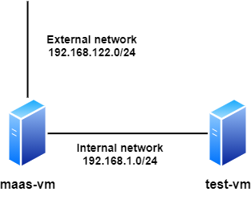

OS Provisioning with MAAS
=========================

DeepOps includes an Ansible [playbook for setting up MAAS](../../playbooks/provisioning/maas.yml),
Canonical's [Metal as a Service](https://maas.io/) tool for provisioning the operating system on bare-metal servers.
By default, this playbook will set up a single-node MAAS install which can then be used to provision other servers on your network.

In most cases, you will use MAAS to provision the OS on multiple bare-metal servers.
However, MAAS can also be used to provision VMs, and this guide will walk through an example using two virtual machines for ease of demonstration.
This guide was written using MAAS 2.8.

MAAS has a lot of different configuration options which are outside the scope of this guide.
For the best reference on how to use MAAS in general, see the [documentation on maas.io](https://maas.io/docs).

## Pre-requisites

In order to set up and use MAAS, you should at minimum have the following components:

* An Ubuntu 18.04 server which you can use to run MAAS
* One or more servers which you will manage using MAAS
* A network connection between all the servers on which you can safely run DHCP. This is needed so that MAAS can provision IP addresses to the nodes it manages.
* A network connection which you can use to log into the MAAS server. This may be the same network as the inter-node network, or it may be a separate network.



In this example, we will use:

* An internal (VM-only) network on which we'll use the subnet `192.168.1.0/24`
* An external network connection on which we'll use the subnet `192.168.122.0/24`
* `maas-vm`, a pre-installed Ubuntu 18.04 virtual machine
    * `maas-vm` has IP `192.168.1.1` on the internal network, and `192.168.122.90` on the external network
* `test-vm`, a "blank" virtual machine with no OS, on the same VM host
    * `test-vm` has a connection only to the internal network, which is not configured yet
    * `test-vm` should be configured to PXE boot on its network interface, rather than boot from its local disk

This guide assumes that you have already set up the virtual networks, created the two VMs, installed Ubuntu on `maas-vm`, and configured the IPs on `maas-vm`.
(You may also have done this using physical machines, but VMs are easier!)
The process for doing this varies, depending on what kind of hypervisor you are using to host your VMs.
Please consult your hypervisor documentation for instructions on doing this.

## Installing MAAS with DeepOps

1. If you haven't already done so, clone the DeepOps repository to your local machine and run `scripts/setup.sh`.
1. Configure DeepOps with basic information about your installation, including the DNS domain, controller IP, and user login information.
    The configuration can be found in `config/group_vars/all.yml`.
    Note that the IP address used for MAAS should be on the internal network; in this example, we're using `192.168.1.1`.
    ```
    maas_adminusers:
      - username: 'admin'
        email: 'admin@{{ maas_dns_domain }}'
        password: 'admin'
    maas_dns_domain: 'deepops.local'
    maas_region_controller: '192.168.1.1'
    maas_region_controller_url: 'http://{{ maas_region_controller }}:5240/MAAS'
    maas_repo: 'ppa:maas/2.8'
    ```
1. Run the Ansible playbook to install:
    ```
    ansible-playbook -l <name-of-maas-node> playbooks/provisioning/maas.yml
    ```

## Configuring MAAS

Once MAAS is installed, the most straightforward way to configure it is via the web interface.

To reach the web inteface, navigate to `http://192.168.122.90:5240/MAAS` in your web browser, and log in using the username and password you set in your configuration.

### SSH keys

After you've logged in, the first thing MAAS will ask for is that you provide one or more SSH public keys.
These keys will be used to automatically set up passwordless SSH on all the nodes which you provision using MAAS.
Make sure this is a key you can easily use to reach your servers, because this is the only way you will be able to log into servers provisioned by MAAS!

If you have public keys posted on Github or Launchpad, MAAS will offer to import these.
Otherwise you should select "Upload" as the source and copy-paste your public keys into the text box provided.
Then click the button to go to the MAAS dashboard.

### OS repositories

After entering SSH keys, you will be redirected to an intro configuration page on which you can configure:

* The name of the MAAS region you are creating
* Connectivity information to the Internet
* The source and versions of Ubuntu which will be downloaded by MAAS to install

In this example, I'm leaving all these parameters at their default values.
This will enable us to install Ubuntu 18.04 on the VM we are installing.

MAAS will sync the necessary package repositories for the installation to your provisioning server (`maas-vm`), which may take some time.
If the repositories are still syncing, the "Continue" button at the bottom will be grayed out.
Once it's clickable, click "Continue".

### Configuring DHCP

At this point you will be redirected to the "Machines" tab on the main MAAS user interface.
However, there should be a warning message on this page, reading:

> DHCP is not enabled on any VLAN. This will prevent machines from being able to PXE boot, unless an external DHCP server is being used.

To configure DHCP on the internal network VLAN, do the following:

1. In the header of the page, click the "Subnets" link
1. On the Subnets page, you should see one or more "fabrics" listed. These are the available networks which can be used to run DHCP and provision servers with MAAS. 
1. Look for the fabric whose subnet matches your internal network (`192.168.1.0/24` in our two-VM example). Then, in this row, click the "untagged" link in the "VLAN" column.
1. This should take you to the page for the Default VLAN on your internal network. The second panel in this page will be for DCHP, and there should be a button all the way to the right labeled "Enable DHCP".
    Click it.
1. On the DHCP configuration page, you will be asked for the configuration of the "Reserved dynamic range". On a real network, you should ensure that the gateway IP is correct, and that the IPs in this range don't overlap with any IPs your site is using. For our example, we will accept the defaults and click "Configure DHCP".


## Booting the test VM from MAAS

### Adding the test VM to the MAAS database

Once MAAS is set up to run DHCP on the internal network, any other machine which is configured to PXE boot should automatically boot from MAAS.
If it isn't a machine which MAAS already knows about, it will boot into the [MAAS enlistment image](https://maas.io/docs/add-machines#heading--enlistment),
which will detect some basic information about the machine and load it into the MAAS database.

To demonstrate this, ensure the second server (`test-vm`) is configured to PXE boot, then boot it up and take a look at its console.
You should see the server PXE boot, and then the console will start scrolling with messages as it loads the MAAS enlistment image.
After a little while, it will show a login prompt that shows its name as `maas-enlisting-node`, and then continue scrolling through several other messages.
After another few minutes, the node will switch off!

### Configuring the test VM for power control (or manual)

In the MAAS web interface, click the "Machines" link in the navigation bar.
The list of machines should now include one entry.
The name of the new machine will be auto-generated from an adjective and an animal, for example "alert-pigeon".

Click the name of the new machine, and this will navigate to a page for this machine.
It should show several auto-detected details about the machine, such as the nymber of CPUs, the memory, and the storage available on the machine.
If you want to, you can also rename the machine by clicking the name at the top of the page.

Before we can deploy this machine, we have to configure it so that MAAS can turn it on or off (or tell MAAS that we will do this manually).

1. On the page for the machine, look for the navigation bar *under* the machine's name.
1. Click Configuration.
1. Scroll down until you see the Power configuration setting.
    If this has already been selected to a pre-configured value, you're good to go, because MAAS has autodetected how to control the power on this node!
1. If it's not yet selected, click the drop-down menu and it will show several different types of power control available.
    For a physical machine, the most common choice will be "IPMI", and will require you to fill in the username and password for the server BMC. 
    MAAS also supports power control via several different types of hypervisors, such as VMWare; these may also require credentials to access.
    If none of these are available for your hypervisor, click "Manual". This will allow you to proceed with deploying your node, but you will have to manually boot it up when needed.
1. Click "Save changes"

### Commission the test VM

Once the machine is configured for power control, you will need to *commission* the machine.
This process is similar to enlistment, but prepares the machine to have an OS deployed.

Navigate to the machine page for your new machine, then click the green "Take action" button in the upper-right hand corner.
Click "Commission", and then click the green "Commission" button to confirm.
If you selected manual power control, you should now turn the machine on.
If using IPMI or VM power control, MAAS will send signals to turn the machine on itself.

At this point, the machine will once again PXE boot from the MAAS server and run commissioning scripts.
Once these are finished it will once again turn itself off.

### Deploying the test VM

Once the machine has completed commissioning, navigate to the machine page for your new machine, then click the green "Take action" button.
Click "Deploy", then confirm by clicking "Deploy machine".
If you selected manual power control, you should now turn the machine on.
If using IPMI or VM power control, MAAS will send signals to turn the machine on itself.

At this point, the machine will PXE boot from the MAAS server and begin installing the OS to the local disk.
After the installation completes, the machine should show as "Deployed" in the MAAS web interface.
And at this point your should be able to log in using the SSH key you configured in MAAS!

### Releasing and reinstalling the machine

1. Navigate to the machine page for the machine you want to reinstall
1. Click the "Take action" button and select Release. This will shut the machine down, and MAAS should show it in a "Ready" state.
1. To reinstall the machine, click the "Take action" button and select "Deploy". There is no need to commission the machine again.

## Scaling up

This is a lot of work for a single machine, but most operations in MAAS can be done in batches.
It's generally straightforward to auto-discover a large number of hosts at a time,
then commission them and provision them by selecting them as a group in the Machines interface.

## Creating a DGX OS image installable by MAAS

The official NVIDIA DGX OS version 5.0 and higher is installable by MAAS by creating a custom OS image.
The code is located in the `submodules/packer-maas` directory. For more information, see: https://github.com/DeepOps/packer-maas/tree/master/dgxos5
