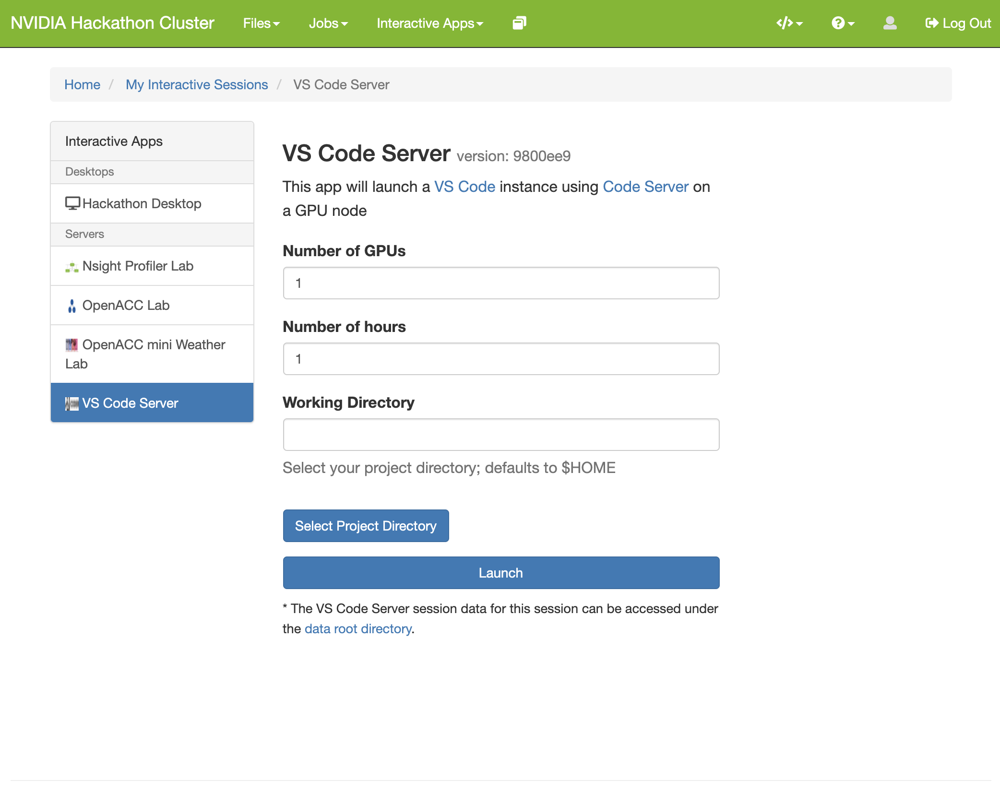
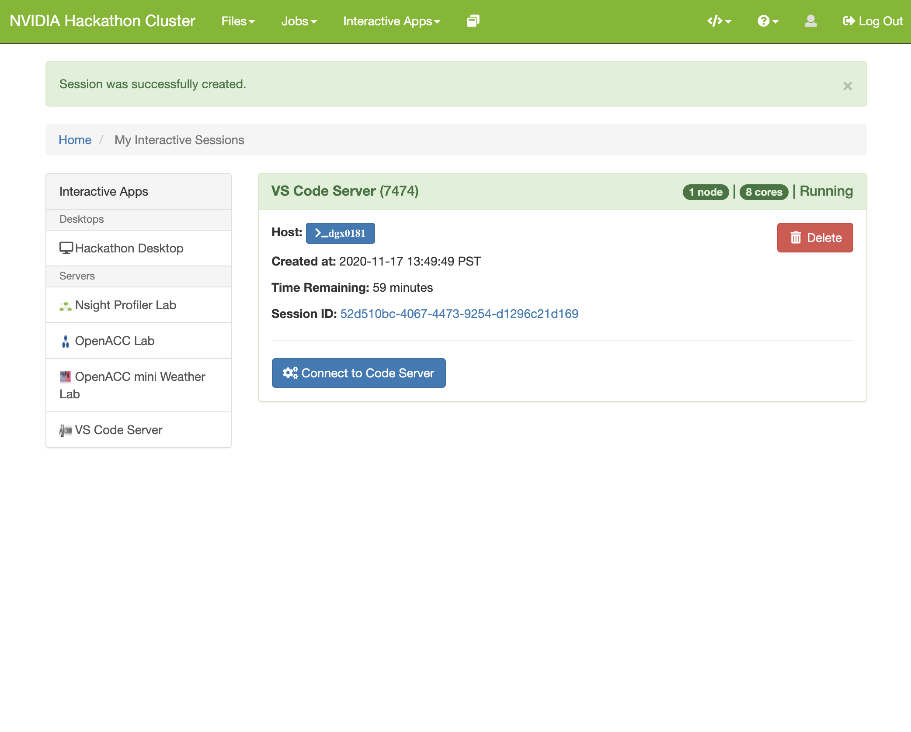
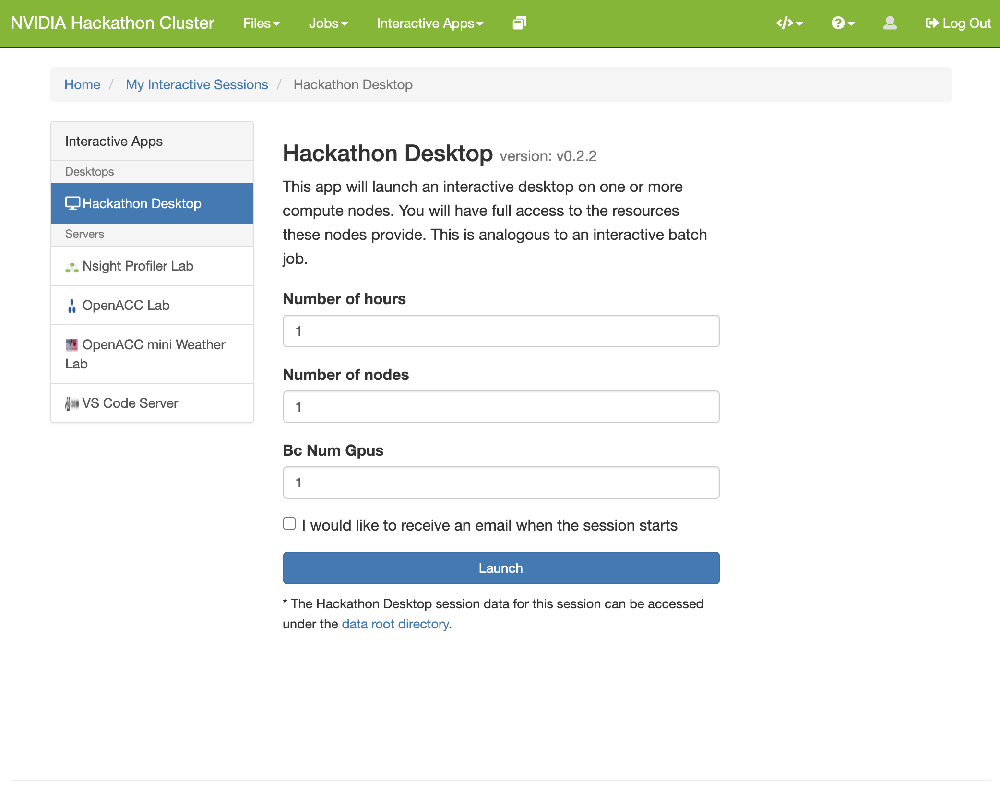
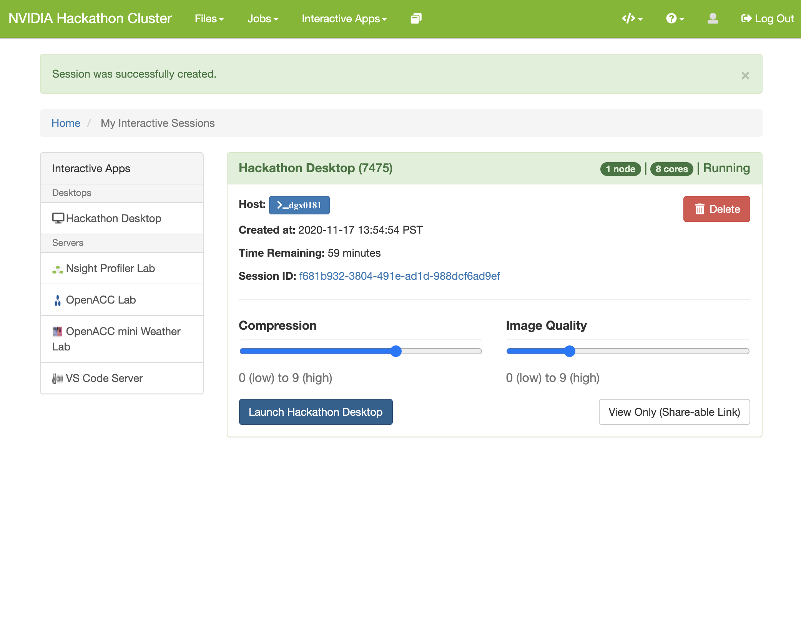

Open OnDemand
===

## Introduction

[Open OnDemand](https://openondemand.org/) is an open-source HPC portal that can be deployed alongside Slurm to provide a useful frontend to the cluster. This allows users to launch interactive sessions through the browser rather than from the command line.

## Deploying

When [deploying slurm with the slurm-cluster.yml playbook](README.md), setting the `install_open_ondemand` variable to `true` will also install Open OnDemand. This can be accomplished by overwriting the variable in `config/group_vars/slurm-cluster.yml`.

## Access

Once deployed, Open OnDemand (OOD) may be accessed via browser at http://<slurm-master>:9050/. Login credentials:

User: _the user that ran the ansible playbook_\
Password: deepops

These settings can also be changed by altering the variables in `config/group_vars/slurm-cluster.yml`.

## Walkthrough

Once logged into OOD, you'll be presented with a simple GUI. For this walkthrough, we'll launch a few interactive apps.

### VS Code Server

Click on the "Interactive Apps" button in the menu bar. Then click on the VS Code Server menu item.

Configure your desired options for the VS Code Server that's being launched. The defaults are 1 GPU and 1 hour of reservation. If you do not enter a working directory, then your `$HOME` directory will be used. Click on the "Launch" button to start the server.

Once the server is ready, you can click on the "Connect to Code Server" button.

Where you will now have a VS Code session tied to the GPU resources you requested. Happy coding!

### VS Code Server

Click on the "Interactive Apps" button in the menu bar. Then click on the "Hackathon Desktop" (this name might vary).

Configure the Desktop with the requested reservation time, number of nodes, and number of GPUs requested. Click on the "Launch" button to start.

The session will start and might take a minute or two to fully launch.

Once launched, click on "Launch Desktop" to get a remote session view.

The remote session view allows you to interact with the resources you requested as if it were a desktop system sitting in front of you.

