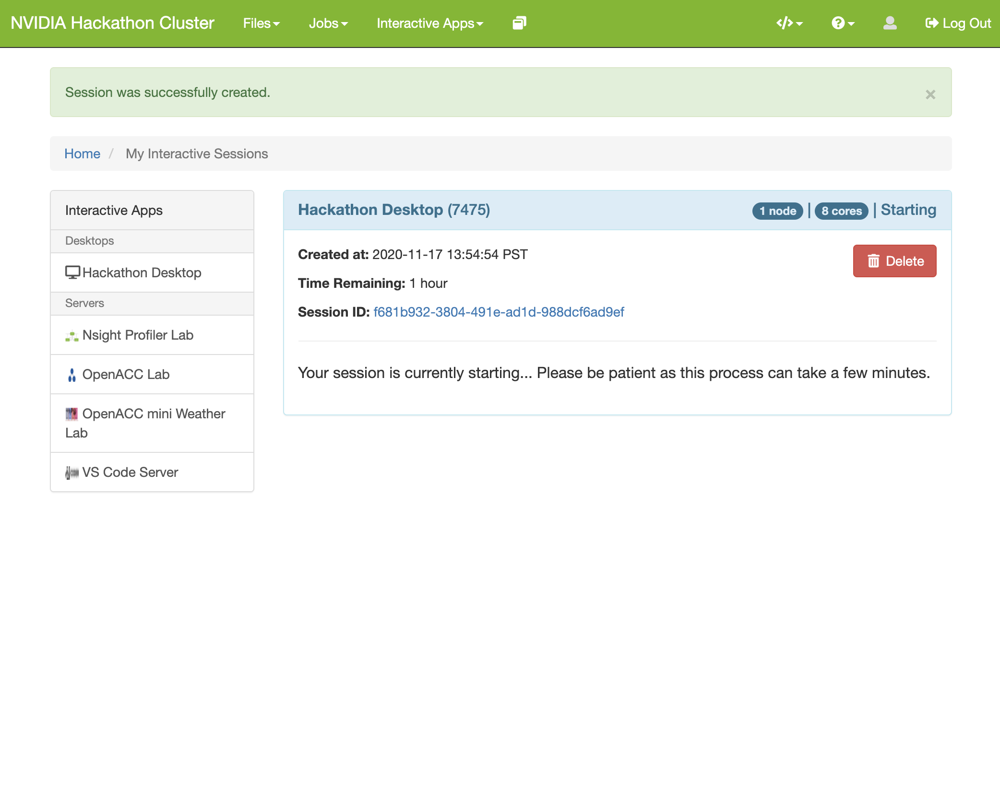

Open OnDemand
===

## Introduction

[Open OnDemand](https://openondemand.org/) is an open-source HPC portal that can be deployed alongside Slurm to provide a useful frontend to the cluster. This allows users to launch interactive sessions through the browser rather than from the command line.

## Deploying

When [deploying slurm with the slurm-cluster.yml playbook](README.md), setting the `install_open_ondemand` variable to `true` will also install Open OnDemand. This can be accomplished by overwriting the variable in `config/group_vars/slurm-cluster.yml`.

## Access

Once deployed, Open OnDemand (OOD) may be accessed via browser at http://<slurm-login-ip>:9050/. Login credentials:

User: <the user that ran the ansible playbook>
Password: deepops

These settings can also be changed by altering the variables in `config/group_vars/slurm-cluster.yml`.

## Walkthrough

