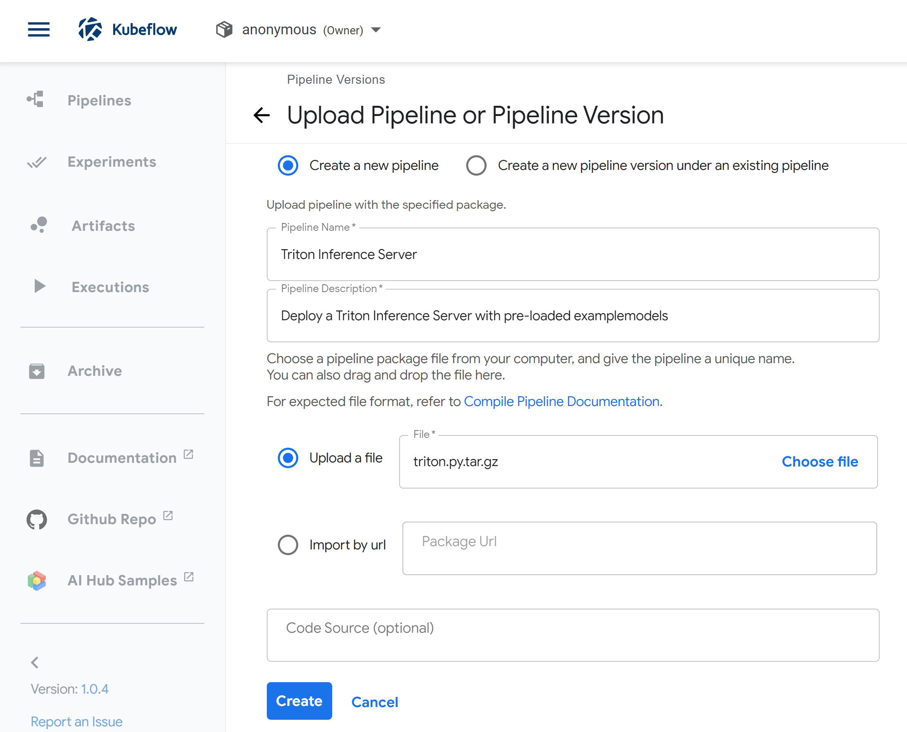
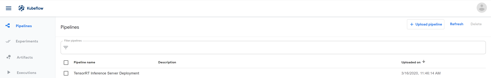
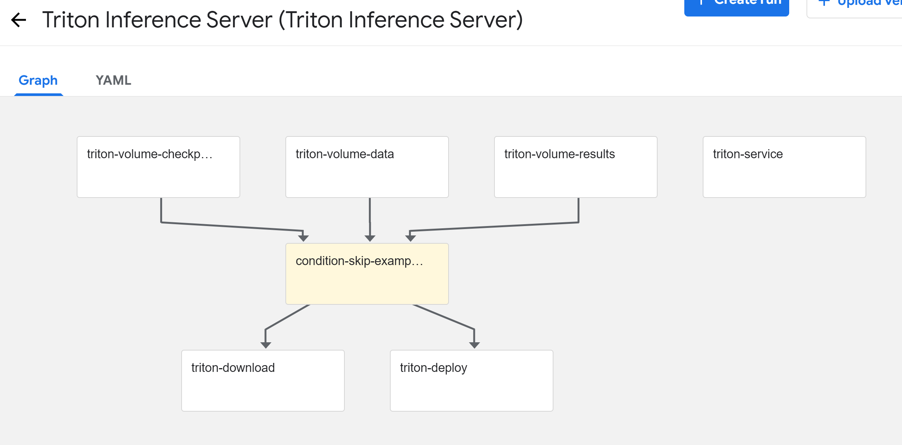
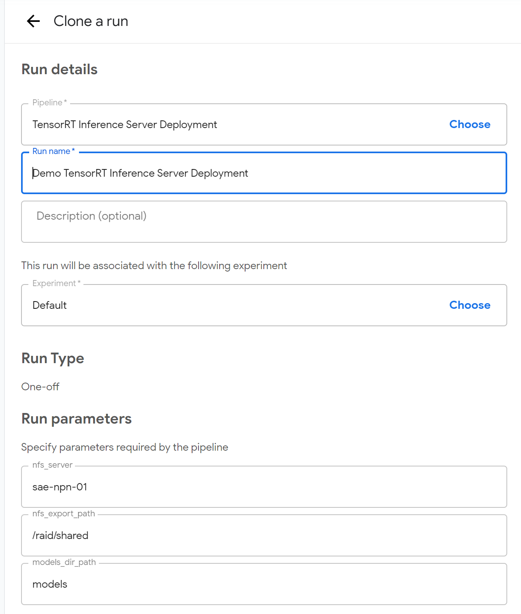

# NGC Triton Inference Server Kubeflow Pipeline

This Kubeflow pipeline will deploy a Triton Inference Server into a Kubernetes cluster. Models are contained within and models directory in an NFS server.

This pipeline aids in the development and testing of end-to-end AI workloads. At the end of an AI training job, this pipeline can be executed to deploy a new Triton Inference Server. This will expose a new endpoint that can be integrated into other components of that application running in QA and development environments.

As part of this pipeline, the example Triton models are downloaded and served.

## Overview

### Basic requirements

* GPU enabled Kubernetes
* [Kubeflow](../../../../docs/k8s-cluster/kubeflow.md)
* [NFS Client Provisioner](../../../../playbooks/k8s-cluster/nfs-client-provisioner.yml) as installed by the default Deepops deployment or other default StorageClass.

### Data Layout

Three PersistentVolumes will be created for `triton-data`, `triton-results`, and `triton-checkpoints`. They are mounted within the Triton server in the following locations:
* /results # For saved & final models
* /data # For data
* /checkpoints # For model checkpoints

### Ports

This pipeline will create 3 `NodePorts` at 30800, 30801, and 30802 for communication with the Triton server.

### Example models:

This pipeline will download models that will work out of the box see [the Triton Inference Server guide](https://docs.nvidia.com/deeplearning/sdk/triton-inference-server-master-branch-guide/docs/run.html#example-model-repository) for additional details.

This can be skipped by setting skip_examples to any non-blank value.

### Usage

1. Build pipeline. (or use prebuilt tar.gz file)
2. Upload pipeline.
3. Execute run of pipeline.
4. Server will continue running until stopped.

### UI Inputs

* skip_examples, set to any non-blank values to skip the download of example models.

### Compiling

```sh
python3 triton.py
```

## Quickstart

1. Deploy Kubernetes following [the DeepOps Kubernetes deployment guide](../../../../docs/kubernetes-cluster.md)

2. Deploy Kubeflow following [the DeepOps Kubeflow deployment guide](../../../../docs/kubeflow.md)

3. Compile the pipeline with `kfp`.
```sh
pip3 install kfp
python3 triton.py
```

4. Upload the Generated triton.py.tar.gz file to pipeline page



5. Create a run of that pipeline using the default parameters:




6. Verify the Triton Inference server can be reached and has loaded th models.

```sh
curl <management IP>:30800/v2/models/densenet_onnx/versions/
```

Successful output will look like:
```sh
{"name":"densenet_onnx","versions":["1"],"platform":"onnxruntime_onnx","inputs":[{"name":"data_0","datatype":"FP32","shape":[3,224,224]}],"outputs":[{"name":"fc6_1","datatype":"FP32","shape":[1000]}]}

```

7. Connect to your management server or worker node and run the [example client](https://docs.nvidia.com/deeplearning/sdk/triton-inference-server-master-branch-guide/docs/client_example.html#section-getting-the-client-examples)
```sh
sudo docker run --net=host -it --rm nvcr.io/nvidia/tritonserver:21.04-py3-sdk /workspace/install/bin/image_client -m densenet_onnx -c 3 -s INCEPTION /workspace/images/mug.jpg
```

Successful output will look like:
```sh
Request 0, batch size 1
Image '/workspace/images/mug.jpg':
    15.349862 (504) = COFFEE MUG
    13.227293 (968) = CUP
    10.425529 (505) = COFFEEPOT
 ```
