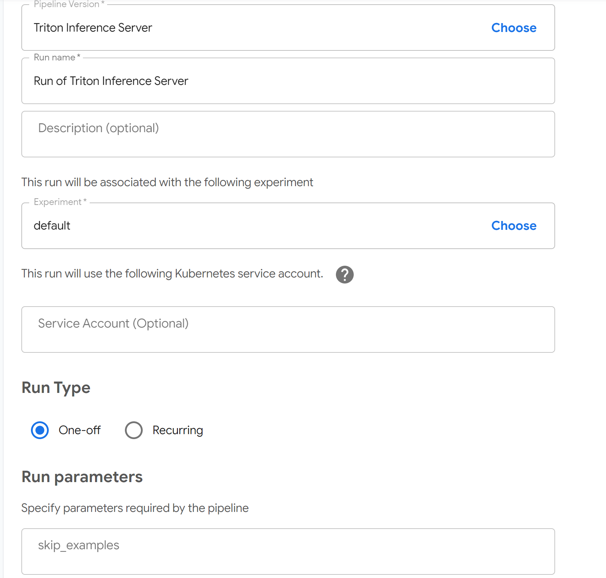

# NGC Triton Inference Server Kubeflow Pipeline

This Kubeflow pipeline will deploy a Triton Inference Server into a Kubernetes cluster. Models are contained within and models directory in an NFS server.

This pipeline aids in the development and testing of end-to-end AI workloads. At the end of an AI training job, this pipeline can be executed to deploy a new Triton Inference Server. This will expose a new endpoint that can be integrated into other components of that application running in QA and development environments.

## Overview

### Basic requirements

* GPU enabled Kubernetes
* Kubeflow 
* NFS Volume

### NFS Layout

The Pipeline expects the root of the NFS mount to have the following three directories:
* \<nfs\>/results # For saved & final models
* \<nfs\>/data # For data
* \<nfs\>/checkpoints # For model checkpoints

### Example models:

To download models that will work out of the box see [the Triton Inference Server guide](https://docs.nvidia.com/deeplearning/sdk/triton-inference-server-master-branch-guide/docs/run.html#example-model-repository)

### Usage

1. Build pipeline.
2. Upload pipeline.
3. Execute run of pipeline. Specify the NFS mount points and model to be loaded.
4. Server will continue running until stopped.

### UI Inputs

* nfs_server, The NFS server. This can be an IP address or a hostname (such as nfs-server-01).
* nfs_export_path, the path to mount on the nfs server (the default configure the built-in DeepOps NFS server deployment is /export/shared).
* models_dir_path, the path to the TRITON models directory on the NFS mount (such as resnet50_netdef)

### Compiling

```sh
python3 triton.py
```

## Quickstart

1. Deploy Kuberenetes following [the DeepOps Kubernetes deployment guide](../../docs/kubernetes-cluster.md)
2. Deploy Kubeflow following [the DeepOps Kubeflow deployment guide](../../docs/kubeflow.md)
3. Uncomment the below three lines in `config/group_vars/all.yml
```sh
# NFS Server
# This config will create an NFS server and share the given exports
# Playbook: nfs-server.yml
nfs_exports:
  - path: /export/shared
    options: "*(rw,sync,no_root_squash)"
```

4. Deploy an NFS server with [Ansible](../playbooks/generic/nfs-server.yml)
```sh
ansible-playbook playbooks/generic/nfs-server.yml
```

5. Create initial directories on the NFS server
```sh
sudo chmod -R 777 /export/shared
mkdir -p /export/shared/results
mkdir -p /export/shared/data
mkdir -p /export/shared/checkpoints
```

6. Download pretrained models (see the [guide](https://docs.nvidia.com/deeplearning/sdk/triton-inference-server-master-branch-guide/docs/run.html#example-model-repository)
```sh
git clone -b v1.12.0 https://github.com/NVIDIA/triton-inference-server.git
bash docs/examples/fetch_models.sh
cp -r docs/examples/model_repository/ /export/shared/results/models
```

7. Compile the pipeline with `kfp`.
```sh
pip3 install kfp
python3 triton.py
```

8. Upload the Generated triton.py.tar.gz file to pipeline page


9. Create a run of that pipeline using the following parameters:

* nfs_server = \<IP address of management server\>
* nfs_export_path = /export/shared
* models_dir_path = models




10. Connect to your management server and run the [example client](https://docs.nvidia.com/deeplearning/sdk/triton-inference-server-master-branch-guide/docs/client_example.html#section-getting-the-client-examples)
```sh
docker run -it --rm tritonserver_client /workspace/install/bin/image_client -m resnet50_netdef images/mug.jpg
```
